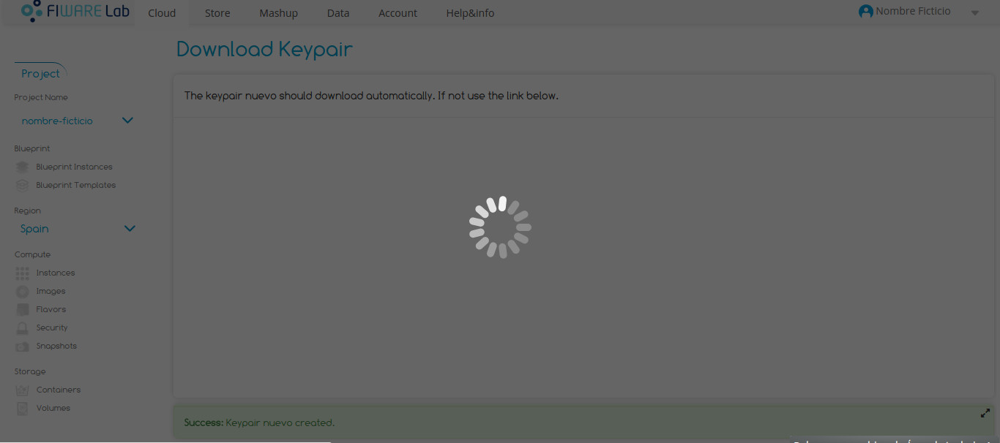
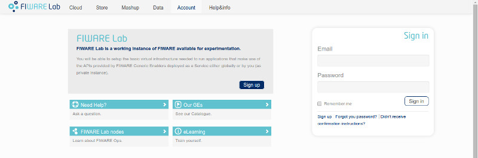
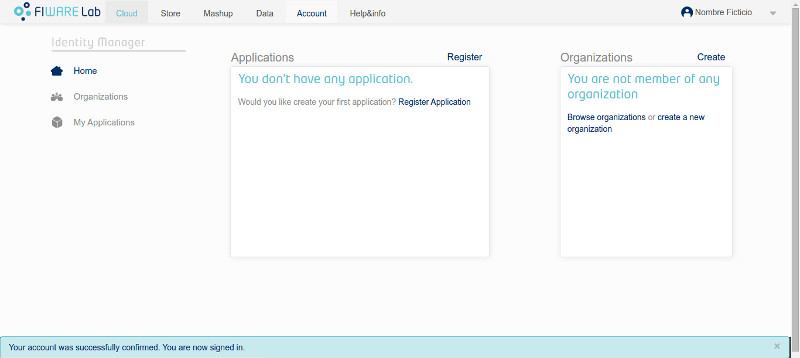
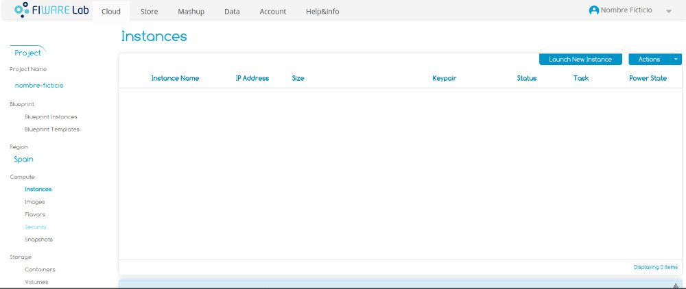
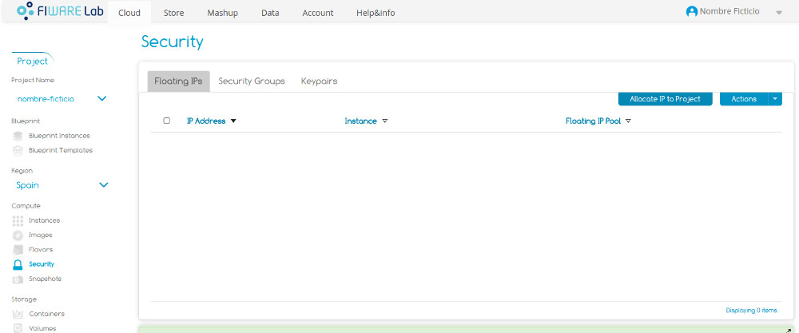
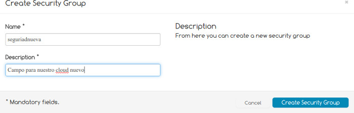
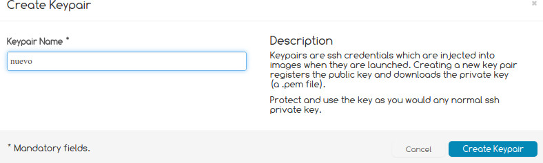

FIWARE-cloud-tuto
=================

Tutorial para utilizar el servicio cloud de FIWARE

Antes de empezar, cabe decir que el proceso requiere de mucha paciencia ya que (al menos cuando se escribe esta página) la página web tiene muchos problemas técnicos y deja de funcionar correctamente.

*Este es un ejemplo de lo que pasa*

Una vez hayamos accedido a [FIWARE LAB](https://account.lab.fi-ware.org/), obtendremos esta página

Deberemos registrarnos, rellenando el siguiente formulario

Cuando rellenemos el formulario, se enviará un email a la dirección de correo electrónico que se ha indicado en el formulario. Una vez confirmada nuestra cuenta (pulsando sobre un enlace que tiene el mail), nos llevará a esta página

En la barra superior, disponemos de varias opciones. Pulsaremos sobre "Cloud", que nos llevará a la siguiente vista

**IMPORTANTE: ¡¡NO LANCES UNA NUEVA INSTANCIA!!**
Antes hay que hacer algunas cosas.

Pulsamos sobre "Security" y tendremos la siguiente vista

Accederemos a la pestaña "Security groups". Crearemos un nuevo grupo de seguridad haciendo click en "Create Security Group". Aparecerá un formulario como el siguiente (que rellenaremos con el nombre que querramos darle al grupo y una breve descripción)

Una vez creado, haremos click derecho sobre él y pulsaremos la opción "Edit rules". Aparecerá una ventana como la siguiente

Crearemos una nueva regla cuyos valores serán:

+ IP Protocol: TCP
+ From port: 22
+ To port: 22
+ Source group: CIDR
+ CIDR: 0.0.0.0/0

Una vez relleno, pulsaremos sobre "Add rule" y veremos como se crea una nueva regla. Podremos cerrar el formulario. Ahora nos dirigiremos a la pestaña "Keypairs". Pulsaremos sobre "Create Keypair" y aparecerá un formulario como el que se muestra a continuación (en el que escribiremos un nombre para nuestro keypair).

