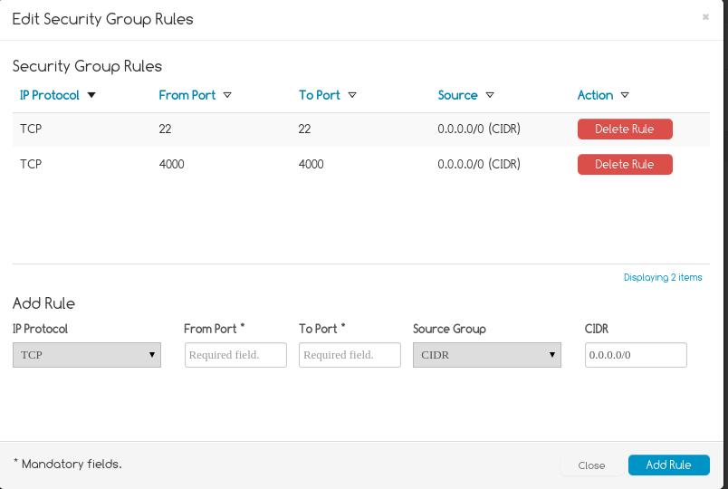
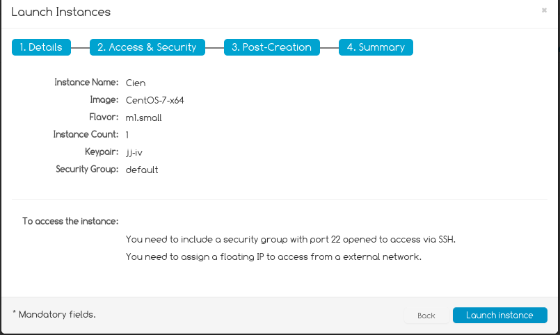

FIWARE-cloud-tuto
=================

Tutorial para utilizar el servicio cloud de FIWARE
--------------------------------------------------

Antes de empezar, cabe decir que el proceso requiere de mucha paciencia ya que (al menos cuando se escribe esta página) la página web tiene muchos problemas técnicos y deja de funcionar correctamente. En algunos casos, si algo va mal la cuenta puede acabar en un estado en el que no se puede recuperar.


*Este es un ejemplo de lo que pasa*
Si te pasa esto, una forma de solucinarlo (para no tener que esperar) es la siguiente:
+ Recarga la página (pulsando "F5", por ejemplo)
+ Interrumpe la recarga de la página (pulsando "Esc", por ejemplo)
+ Vuelve a cargar la página (de nuevo, "F5")
+ Obtendrás un mensaje de error en la parte inferior de la página. Tendrás que volver a intentar hacer lo que estabas haciendo cuando la página se quedó "colgada" (aunque pierdas la configuración, cuando la web ha dejado de responder ya la habías perdido -así por lo menos no pierdes el tiempo-).


Una vez hayamos accedido a [FIWARE LAB](https://account.lab.fi-ware.org/), obtendremos esta página


Deberemos registrarnos, rellenando el siguiente formulario


Cuando rellenemos el formulario, se enviará un email a la dirección de correo electrónico que se ha indicado en el formulario. Una vez confirmada nuestra cuenta (pulsando sobre un enlace que tiene el mail), nos llevará a esta página


En la barra superior, disponemos de varias opciones. Pulsaremos sobre "Cloud", que nos llevará a la siguiente vista

><font color="red">**IMPORTANTE: ¡¡NO LANCES UNA NUEVA INSTANCIA!!**</font>
>Antes hay que hacer algunas cosas.


Pulsamos sobre "Security" y tendremos la siguiente vista


Accederemos a la pestaña "Security groups". Crearemos un nuevo grupo de seguridad haciendo click en "Create Security Group".

>Esto no es estrictamente necesario, pero viene bien. En caso de no crear un nuevo *security group* lo de abajo se aplica al grupo por omisión, *default*.

Aparecerá un formulario como el siguiente (que rellenaremos con el nombre que querramos darle al grupo y una breve descripción)


Una vez creado, haremos click derecho sobre él y pulsaremos la opción "Edit rules". Aparecerá una ventana como la siguiente



Crearemos una nueva regla cuyos valores serán:

+ IP Protocol: TCP
+ From port: 22
+ To port: 22
+ Source group: CIDR
+ CIDR: 0.0.0.0/0

Una vez relleno, pulsaremos sobre "Add rule" y veremos como se crea una nueva regla. En realidad, este paso se puede hacer en cualquier momento. El puerto 22 es que usaremos más adelante para conectarnos por `ssh`.

Podemos cerrar el formulario. Ahora nos dirigiremos a la pestaña "Keypairs". Pulsaremos sobre "Create Keypair" y aparecerá un formulario como el que se muestra a continuación (en el que escribiremos un nombre para nuestro keypair).


Es muy importante que en este momento te descargues el fichero de identidad, con la extensión `.pem` y que lo guardes en el directorio `.ssh` o el que suelas usar para este tipo de cosas.

>Y es importante porque si no lo haces ahora, no lo vas a poder hacer nunca; no se puede acceder al fichero una vez creado (o no hemos visto como hacerlo). Uno de los problemas de usabilidad que tiene este FIWARE.

También debes cambiar los permisos de la clave privada que acabas de descargar para que sólo el usuario tenga acceso de lectura a la misma:

```
chmod 400 ~/.ssh/identity.pem
```

Finalmente, hay que crear una *IP flotante* para poder acceder a ella desde fuera. En el mismo grupo, vamos a la solapa *Floating IPs" y pulsamos sobre *Allocate IP to Project". En FI-Ware se permiten varias máquinas virtuales, pero sólo se puede acceder a una de ellas desde el exterior. Esta IP la usarás más adelante para eso.

## Creación de una instancia

Cambiamos de sección del menú de la izquierda: *Instances* (con 9 puntitos) y de ahí, el botón azul "Launch new instance", que lanzará inicialmente una pantalla en la que se selecciona el tipo de la imagen. Puedes seleccionar la que más te guste, aunque para aplicaciones específicas necesitarás alguna específica como `iot-broker-R3.4`. Si no vas a hacerlo, prueba cualquiera de las imágenes de Ubuntu o CentOS que hay.

A partir de ahí hay tres pasos.

1. Darle nombre a la instancia
2. Seleccionar un *flavor*: small o tiny. La más pequeña es la tiny, la *small* es un poco más grance, con 10GB y 2 Gigas de memoria. *Instance count* es cuantas del mismo tipo queremos usar. Se pulsa Next.
3. Seleccionar el *keypair* que hemos creado antes y el grupo de seguridad que hemos creado o el *default*. Se pulsa Next y se llega a "customization Script", que por lo pronto no vamos a usar. Next otra vez.
4. La pantalla de resumen te muestra algo así:

>Vale, eran tres pero este último no cuenta



y puedes pulsar en *Launch instance* de nuevo.

Una vez hecho esto, se irá creando y arrancando la máquina virtual hasta que en la columna *Power state* indique *RUNNING*.

##Acceder a la máquina desde fuera

Primero habrá que asignarle una IP, la que hemos generado antes. La IP con la que se crea sólo deja acceder desde la Intranet del propio FIWARE. Así que volvemos a la opción Security -> Floating IPs, marcamos la que tenemos y le damos a Actions-> Associate IP.

En la pantalla nos saldrán las MVs que tenemos. Seleccionamos una y en la segunda opción del menú seleccionamos su IP interna. Ya tenemos IP, algo por el estilo de `130.206.x.y`.

Puedes usar el fichero de identidad que te has descargado antes para acceder desde el exterior, de esta forma

```
ssh -i ~/.ssh/identity.pem root@130.206.x.y
```

de donde entrarás en la línea de órdenes con privilegios de `root`. Como hacerlo así todo el tiempo puede ser un poco latoso, puedes también copiar [tu clave pública](http://git-scm.com/book/es/v1/Git-en-un-servidor-Generando-tu-clave-p%C3%BAblica-SSH) para acceder cuando lo desees

```
cat ~/.ssh/id_rsa.pub | ssh -i ~/.ssh/identity.pem root@130.206.x.y "mkdir -p ~/.ssh && cat >>  ~/.ssh/authorized_keys"
```

usando, directamente,

```
ssh  root@130.206.x.y
```

## A dónde ir desde aquí

Tienes una máquina virtual, puedes hacer con ella lo que desees. Instalar, desinstalar, o tirarla y meter una nueva.
